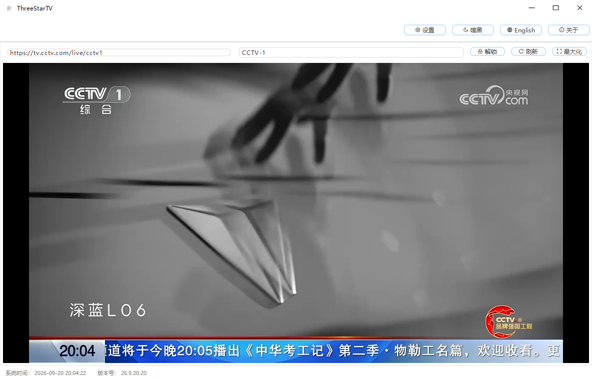
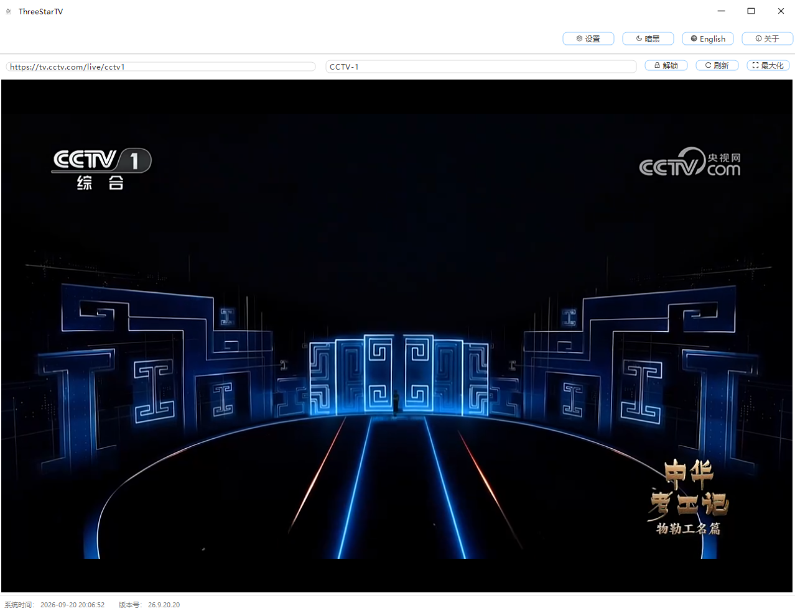

# ThreeStarsTV | 三颗星电视

基于 .NET 8 的 WinForms 电视直播播放软件：启动即自动播放 CCTV-1 高清直播，搭配 .NET Framework 4.8 启动器分发为**单个便携式 exe**（内嵌 .NET 8 运行时安装包 + 主程序），插上就能放电视。

## 功能

- **启动即播**：默认自动播放 CCTV-1 直播（m3u8/HLS 流，内嵌 hls.js 播放器，无需联网加载播放器）
- **失败自动回退**：直播流连续 3 次失败自动切换到央视网网页播放器（`tv.cctv.com/live/cctv1`），并自动点击网页"全屏"按钮
- **傻瓜式启动设置**（设置 → 软件设置 → 启动设置，全部持久化）：
  - 自动取消静音（默认开，开机即有声音）
  - 开机启动（shell:startup 快捷方式，防重复创建、只删自己的快捷方式）
  - 窗口置顶、启动时最大化
- **加载提速**：启动后台预热预取（DNS/TLS 握手前置）；全单元格共享 WebView2 环境，央视网页面依赖二次启动起走本地缓存；加载遮罩实时显示"加载中 xxx ms"与进度条
- **网址收藏**（设置 → 网址收藏）：默认内置 CCTV-1~13 网页地址与 m3u8 推流地址，支持双击编辑、复制到剪贴板、添加/删除，持久化到 `UrlFavorites.json`
- 1–16 路播放网格：每路可填任意网页或 m3u8 地址，支持备注/锁定/刷新/最大化，错峰加载
- 中英文界面、明亮/暗黑主题，关闭最小化到系统托盘
- 配置 JSON 持久化，exe 旁放置 `portable.txt` 即启用便携模式，否则存 `%LOCALAPPDATA%\ThreeStarTV\`

## 运行截图

| 截图 | 说明 |
|---|---|
|  | 主界面播放 CCTV-1 |
|  | 主界面播放 CCTV-1 |

## 技术栈

| 部分 | 技术 |
|---|---|
| 主程序 `ThreeStarsTV/` | .NET 8 WinForms（纯 C#），AntdUI 2.4.10，Microsoft.Web.WebView2，内嵌 hls.js@1 |
| 启动器 `ThreeStarsTV.Launcher/` | .NET Framework 4.8，内嵌运行时安装包与主程序 exe 资源 |
| 其他 | FluentFTP（JOBX 备份功能，界面已隐藏保留）、WScript.Shell（开机启动快捷方式） |

启动器工作流程：检测 `Microsoft.WindowsDesktop.App 8.x` → 缺失则静默安装内嵌运行时 → 覆盖释放主程序到 `%LOCALAPPDATA%\ThreeStarTV\App\` 并启动。

## 构建

需要：.NET SDK 8+、MSBuild（Visual Studio 或 .NET Framework 4.8 自带）。

```bash
bash build-with-timestamp.sh
```

产物：`dist/ThreeStarsTV_<yyyyMMddHHmm>.exe`（单文件，直接拷贝运行）。

## 部署注意事项

- 主程序依赖 **WebView2 运行时**；部分精简版 Win10 可能缺失，首次运行需联网下载，或另行部署 WebView2 离线包
- 启动器内嵌 .NET 8 运行时安装包，完全离线也能完成运行时安装
- 播放直播流与央视网回退页需要目标机器可访问对应域名
